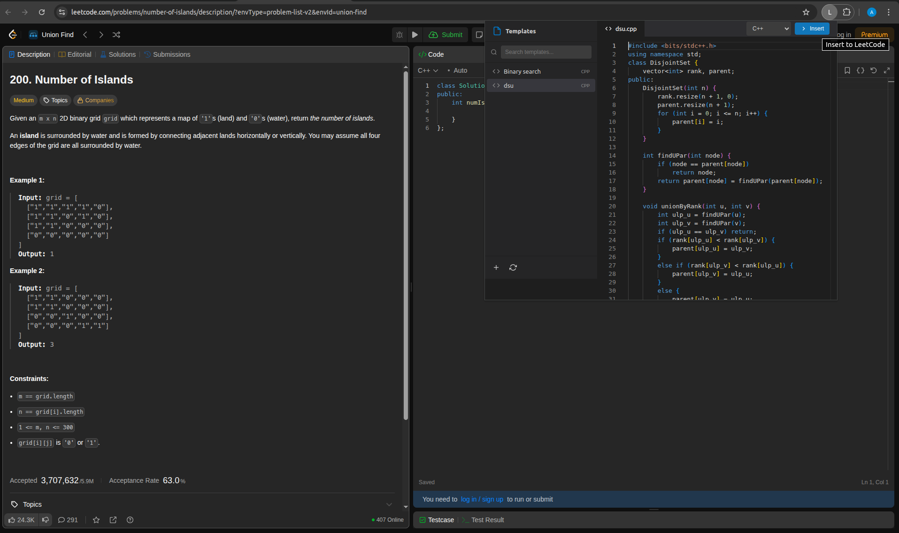
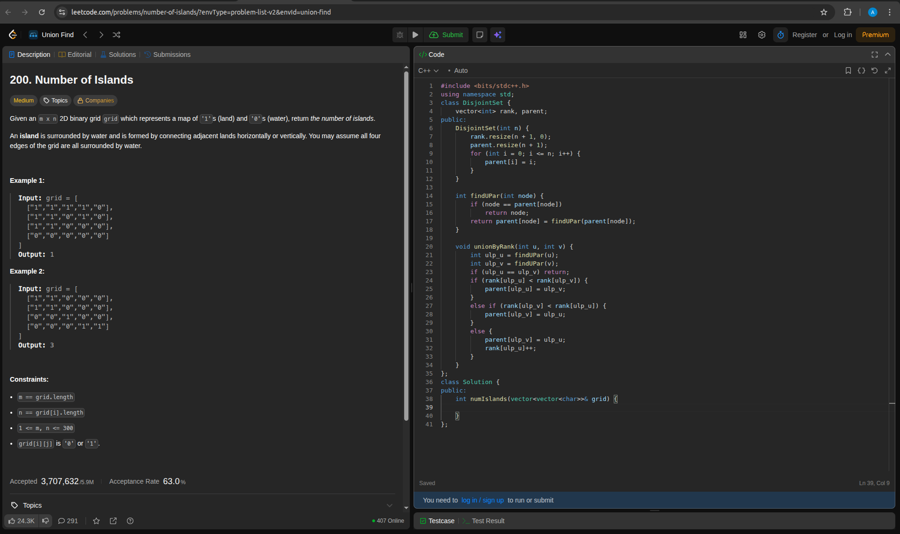

# QuickLC

QuickLC is a Chrome extension that streamlines LeetCode workflow by enabling users to create, manage, and insert code templates directly into the LeetCode editor. The extension features an integrated Monaco Editor for an enhanced coding experience.

## Features

* **Template Management:** Create, save, search, and delete code templates
* **Multi-Language Support:** Compatible with C++, Python, Java, and other programming languages
* **Integrated Code Editor:** Syntax highlighting powered by Monaco Editor
* **Quick Insertion:** Insert templates into the LeetCode editor with a single click
* **Persistent Storage:** Templates stored locally in a database
* **Modern Interface:** Clean, intuitive UI design

## Screenshots

### Template Management Interface


### Code Editor View


## Installation

### Prerequisites

* [Node.js](https://nodejs.org/) and [npm](https://www.npmjs.com/)
* [MongoDB](https://www.mongodb.com/try/download/community) (local installation or remote connection)

### Backend Setup

1. Clone the repository:
```bash
git clone https://github.com/arpitkumar0007/QuickLC.git
cd QuickLC
```

2. Navigate to the backend directory and install dependencies:
```bash
cd backend
npm install
```

3. Create a `.env` file in the `backend` directory:
```bash
touch .env
```

4. Add your MongoDB connection URI to the `.env` file:
```
MONGO_URI=mongodb://localhost:27017/quicklc
PORT=5000
```

5. Start the backend server:
```bash
node server.js
```

The server will run at `http://localhost:5000`. Keep this terminal window open while using the extension.

**Note:** Make sure MongoDB is running before starting the server. If you have MongoDB installed locally, start it with:
```bash
mongod
```

### Frontend Setup

1. **Monaco Editor Installation:**
   * Create a `vendor` directory inside the `extension` folder
   * Inside `vendor`, create a `monaco-editor` directory
   * Download and extract the Monaco Editor package from the [Monaco Editor Releases](https://github.com/microsoft/monaco-editor/releases) page
   * Locate the `min` folder inside the extracted package
   * Copy the entire `min` folder and paste it inside `extension/vendor/monaco-editor/`
   
   Final structure:
   ```
   extension/
   └── vendor/
       └── monaco-editor/
           └── min/
               └── vs/
                   ├── assets/
                   ├── basic-languages/
                   ├── editor/
                   └── ... (and all other files)
   ```

2. **Chrome Extension Installation:**
   * Open Chrome and navigate to `chrome://extensions`
   * Enable **Developer mode**
   * Click **Load unpacked**
   * Select the `extension` folder from the project directory

## Usage

1. Ensure the backend server is running (`node server.js` in the `backend` directory)
2. Navigate to a problem on [LeetCode](https://leetcode.com/)
3. Click the QuickLC extension icon in the Chrome toolbar
4. Add, search, or select a template from the sidebar
5. Click **Insert** to inject the code into the LeetCode editor

## Technical Stack

* **Frontend:** HTML, CSS, JavaScript
* **Backend:** Node.js, Express.js
* **Database:** MongoDB with Mongoose
* **Code Editor:** Monaco Editor
* **Extension API:** Chrome Extension Manifest V3

## Troubleshooting

* **Backend won't start:** Ensure MongoDB is running and the connection URL in `.env` is correct
* **Templates not saving:** Check that the backend server is running and accessible at `http://localhost:5000`
* **Monaco Editor not loading:** Verify the Monaco Editor files are correctly placed in `extension/vendor/monaco-editor/min/`

